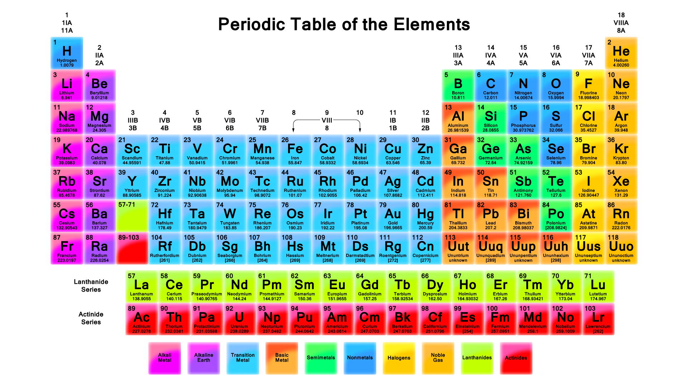

[jquery-remap](http://www.xodustech.com/development/jquery-remap)
============

jQuery responsive design or dynamic size image map remaping plugin

## Why is this useful?
With the current trend of responsive web design sites now need the ability to scale elements relative to the overall browser size. Many sites make use of image maps which contain pixel based coordinates representing different clickable areas on the respective image. When that image is scaled the image map does not automatically scale making image maps impractical for responsive design.

Thats where jQuery Remap comes in: Simply call .remap() on your image and now no matter what size the image is scaled to the image map is also scaled proportionally.

## Usage
```js
$(function() {
  $('img').remap();  
});
```
Using jQuery Remap couldn't be simpler, call .remap() on an image or collection of images. This has been tested using jQuery 1.9.0 and uses no deprecated functions.

### Example
```html
<html>
<head>
  <title>jQuery - Remap</title>
	<script type="text/javascript" src="http://ajax.googleapis.com/ajax/libs/jquery/1.9.0/jquery.min.js"></script>
	<script type="text/javascript" src="jquery.remap.js"></script>
	<script type="text/javascript">
	$(function() {
		$('img').remap();
		$('area').click(function(e) {
			alert($(this).attr('alt'));
			e.preventDefault();
		});
	});
	</script>
</head>
<body style="margin: 0px;">
	
	<map name="image-map">
		<area shape="rect" coords="142,102,230,193" href="#" alt="Hydrogen">
		<area shape="rect" coords="1691,104,1779,191" href="#" alt="Helium">
		<area shape="rect" coords="144,198,230,284" href="#" alt="Lithium">
		<area shape="rect" coords="235,195,322,284" href="#" alt="Beryllium">
		<area shape="rect" coords="1233,196,1323,281" href="#" alt="Boron">
		<area shape="rect" coords="1326,195,1413,282" href="#" alt="Carbon">
		<area shape="rect" coords="1417,196,1505,281" href="#" alt="Nitrogen">
		<area shape="rect" coords="1507,195,1595,284" href="#" alt="Oxygen">
		<area shape="rect" coords="1599,195,1687,282" href="#" alt="Flourine">
		<area shape="rect" coords="1690,196,1777,283" href="#" alt="Neon">
	</map>
</body>
</html>
```

In this example (included in the repo) a single image is loaded at 100% of the browser width. This makes it possible to use one image as a coming soon banner for a website with clickable locations such as twitter or facebook shares.
